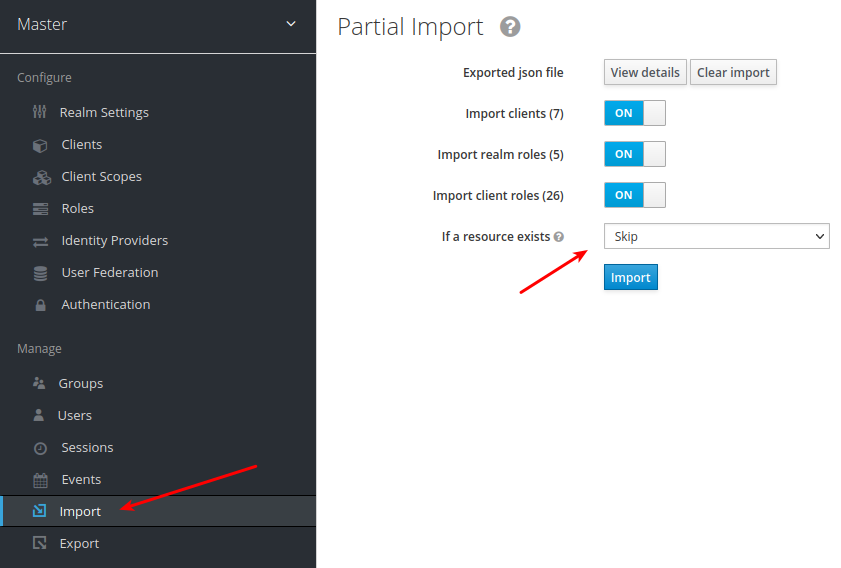

# Constr SW 2022/2 - Grupo 3

## COMO que eu INICIO isso???

### **Docker(keycloak) + Node(api)**

Obrigatório:
- Docker
- Node 16+ (certifique-se que o npm está na versão 7 para cima)

Passos para iniciar:
- Instale as dependências `npm i`
- Inicie o keycloak `npm run up:keycloak`
- Inicie a api rest `npm start`
- Abra o url `http://localhost:8080/auth`
- Clique em `Administration Console`
- Logue com user `admin` e senha `a12345678`
- Importe o REALM do keycloak (selecione o arquivo `keycloak-realm-export.json` dentro da pasta do projeto) (**`MARQUE O SKIP!!!`**):

Passos para parar:
- Feche o terminal da api rest
- Execute `npm run down:keycloak`

## COMO que eu USO isso???

TBD (rotas, swagger...)
